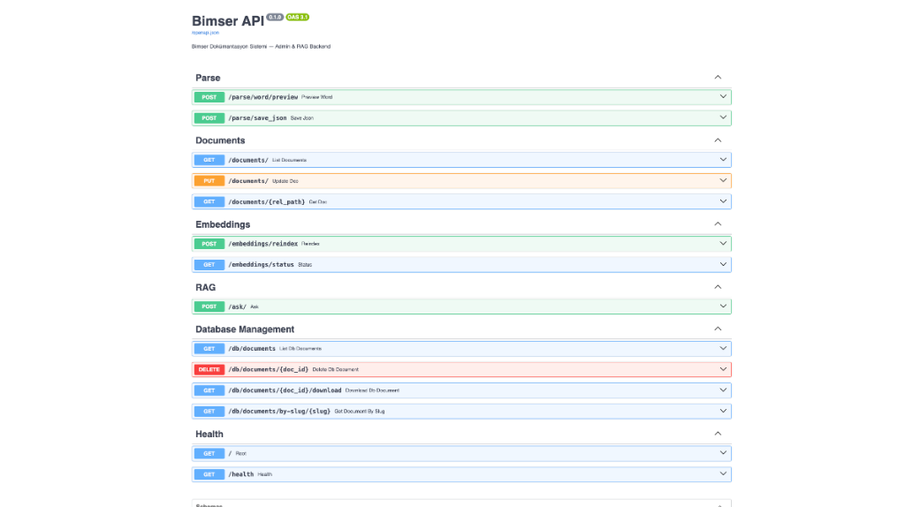

<div align="center">
  <h1>Bimser RAG & Document API</h1>
  <p>Akıllı Doküman Analizi, Vektör Arama ve Llama 3.1 Destekli RAG (Retrieval-Augmented Generation) Backend Altyapısı</p>
</div>

---

## Proje Hakkında

Bu proje, kurum içi dokümanların (Word, PDF vb.) sisteme yüklenip, **Ollama (Llama 3.1)** ve **PostgreSQL (pgvector)** kullanılarak anlamsal olarak analiz edilmesini ve yapay zeka aracılığıyla sorgulanmasını sağlayan güçlü bir API servisidir.

### Öne Çıkan Özellikler

*   **RAG (Retrieval-Augmented Generation):** Şirket dokümanlarınızı yapay zeka hafızasına katarak spesifik sorulara doğru yanıtlar üretme.
*   **Vektör Veritabanı:** `pgvector` eklentisiyle HNSW indekslemesi yaparak milisaniyeler içinde anlamsal arama (Semantic Search).
*   **Gelişmiş Döküman İşleme (Parsing):** Word vb. dokümanları otomatik parçalara (chunk) bölerek Vektör uzayına çıkarma.
*   **Local LLM Desteği:** Veri gizliliği için bulut API'leri (OpenAI vb.) yerine tamamen lokalde koşan **Ollama** entegrasyonu.

---

## API Arayüzü (Swagger UI)

FastAPI tarafından otomatik oluşturulan modern ve interaktif dokümantasyon ekranı:



---

## Mimari ve Teknolojiler

*   **Framework:** Python 3.11, FastAPI, Starlette
*   **Veritabanı:** PostgreSQL 16 + AsyncPG + SQLAlchemy
*   **Yapay Zeka (LLM):** Ollama (Llama 3.1 8B, Nomic-Embed-Text)
*   **Konteynerleştirme:** Docker & Docker Compose

---

## Kurulum (Local Development)

Sistemi kendi bilgisayarınızda (Localhost) tek tuşla ayağa kaldırmak için aşağıdaki adımları izleyin:

### Gereksinimler
*   Docker Desktop
*   Git

### Adım Adım Kurulum

1.  **Projeyi Klonlayın:**
    ```bash
    git clone https://github.com/kadirerentugran/bimser-rag-api.git
    cd bimser-rag-api
    ```

2.  **Konteynerleri Başlatın:**
    Bütün sistemi (API, Postgres, Ollama) otomatik kurmak için:
    ```bash
    docker-compose up -d --build
    ```

3.  **Veritabanını Hazırlayın:**
    PostgreSQL içerisinde tabloları ve `pgvector` eklentisini oluşturmak için:
    ```bash
    docker exec -it bimser_api python scripts/init_db.py
    ```

4.  **Test Edin:**
    Tarayıcınızdan şu adrese giderek API'yi test edebilirsiniz:
    **[http://localhost:8000/docs](http://localhost:8000/docs)**

---
